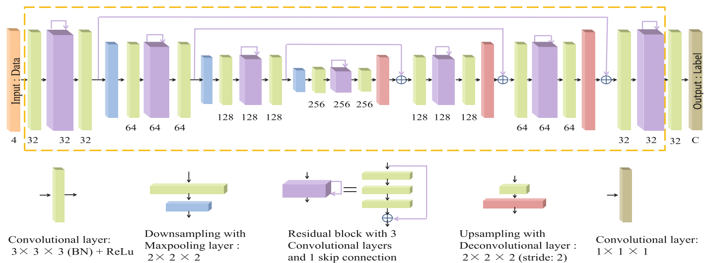
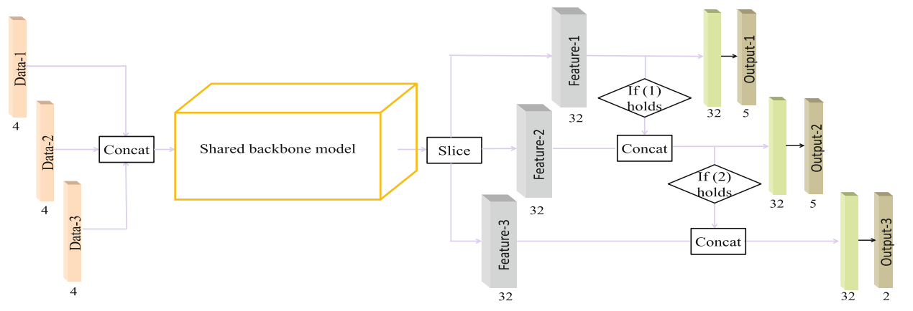

# OM-Net

This is the code release for the TIP paper "One-pass Multi-task Networks with Cross-task Guided Attention for Brain Tumor Segmentation" and MICCAI 2018 paper "One-Pass Multi-task Convolutional Neural Networks for Efficient Brain Tumor Segmentation".

This work overcomes the shortcomings of popular model cascade strategy that can lead to undesired system complexity and ignore the relevance among the models due to its multiple separate cascaded models. We propose to adopt multi-task learning to integrate multiple segmentation tasks into a deep model which is called [*One-pass Multi-task Network (OM-Net)*](https://doi.org/10.1007/978-3-030-00931-1_73).

OM-Net exploits correlation among tasks to achieve superior performance, with only one-third model parameters of model cascade strategy and one-pass computation. It ranks 1st on the BraTS 2015 test set and achieves top performance on BraTS 2017 validation set.

## Model

Firstly, we split multi-class brain tumor segmentation into three segmentation tasks: *1) Coarse segmentation to detect complete tumor*. *2) Refined segmentation for complete tumor and its intra-tumoral classes*. *3) Precise segmentation for enhancing tumor*.

For model cascade framework, each task is implemented by an independent basic network. Our basic network used in model cascade framework is a 3D variant of the [Fusionnet](https://arxiv.org/abs/1612.05360). See picture below. 

OM-Net integrates three tasks with their respective training data being the same as those in model cascade framework. Its architecture is illustrated in the picture below. Each task owns its task-specific parameters and the shared backbone model is aimed to learn the correlation among the tasks. Specifically, the shared backbone model refers to the network layers outlined by the yellow dashed line in 3D_fusionnet.png.

Cross-task guided attention (CGA) module is further proposed to share prediction results between tasks of OM-Net, which can  make use of the prediction results generated by the previous task to produce finer category-specific statistics. Thus, CGA can adaptively recalibrate channel-wise feature responses based on these category-specific statistics, so as to boost the segmentation performance for the current task.

Please read these two papers for more detailed information.

Please note that we train OM-Net and OM-Net + CGA using 2GPUs simultaneously, so the batchsize in the .prototxt file is 10.

## Usage

All implementations are based on the [C3D](https://github.com/facebook/C3D), which is a 3D modified version of BVLC caffe.

Please clone the C3D repository and download these files.

## Citation

If you find the papers and code helpful for your research, please cite the following papers:

C. Zhou, C. Ding, Z. Lu, X. Wang, and D. Tao, “One-pass Multi-task Convolutional Neural Networks for Efficient Brain Tumor Segmentation,” in Proc. Int. Conf. Med. Image Comput. Comput.-Assist. Intervent, 2018, pp. 637–645.
C. Zhou, C. Ding, Z. Lu, X. Wang, and D. Tao, “One-pass Multi-task Networks with Cross-task Guided Attention for Brain Tumor Segmentation,” IEEE Trans. Image Process., doi: 10.1109/TIP.2020.2973510, 2020.

## Contact

eezhouch At mail.scut.edu.cn

